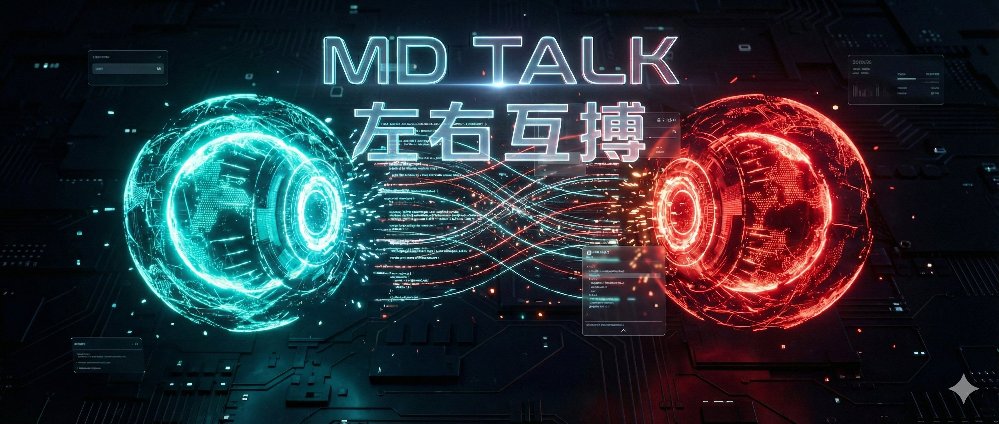
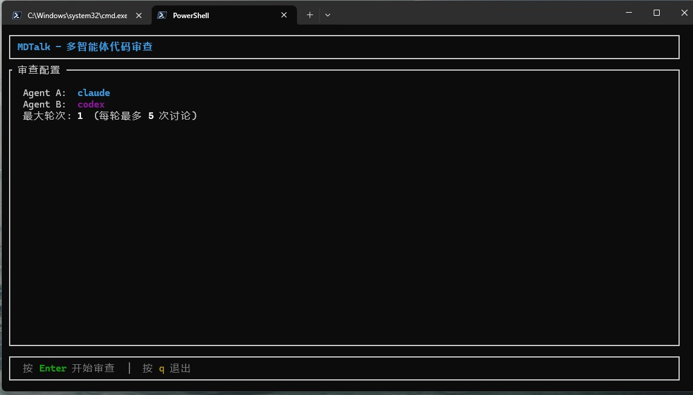
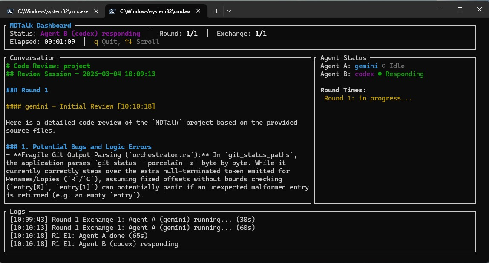
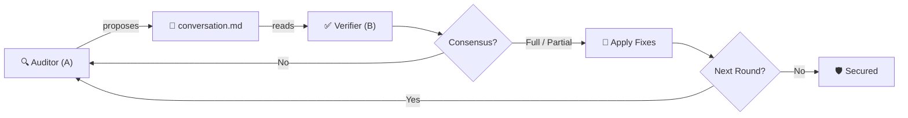

<div align="center">



<br>

<h1>MDTalk <small>(左右互搏)</small></h1>

<p><b>Autonomous Adversarial Code Review System</b></p>
<p><i>Your AI says "LGTM". MDTalk says "Prove it."</i></p>

<p>
  <a href="https://www.rust-lang.org/"></a>
  <a href="https://github.com/cloveric/mdtalk"></a>
  <a href="LICENSE"></a>
  <a href="https://github.com/cloveric/mdtalk/stargazers"></a>
</p>

<p>
  <a href="#features">Features</a> •
  <a href="#work-interface">Interface</a> •
  <a href="#quick-start">Quick Start</a> •
  <a href="#简体中文">简体中文</a>
</p>

</div>

> **MDTalk** is an uncompromising, multi-agent code auditing framework. It replaces passive AI compliance with rigorous adversarial debate, ensuring mission-critical code quality through cross-examination.
>
> *The Chinese name **左右互搏 (Zuo You Hu Bo)** originates from the classic Wuxia novel "The Legend of the Condor Heroes". It describes an advanced martial arts technique where a warrior's left and right hands fight each other independently—perfectly symbolizing our dual-agent adversarial architecture.*

## The Illusion of "LGTM"

You push a complex feature. You ask a single AI model to review it. In seconds, it replies: *"Looks great to me!"*

Production breaks. Why? Single-agent AI is inherently compliant and prone to hallucination. It misses edge cases, race conditions, and semantic flaws because it lacks a verification mechanism.

## The Solution: Adversarial Intelligence

**MDTalk** deploys a dual-agent architecture to completely eliminate AI complacency.

- **The Auditor (Agent A):** Systematically analyzes your codebase, proposing vulnerabilities, anti-patterns, and logical flaws.
- **The Verifier (Agent B):** Skeptically validates every claim made by the Auditor against the actual source code.

They engage in an autonomous, rigorous debate. **No human intervention is required.** They cross-examine, push back, and iterate until a mathematically hard consensus is reached. Only then are verified fixes applied directly to your codebase.

> *In our internal benchmarks, a single AI missed 5 critical bugs. MDTalk found all of them, debated the optimal fix, and applied the changes across 9 files autonomously.*

## Features

- **Adversarial Debate Engine:** Two independent AI models (e.g., Claude & Codex) auditing each other to guarantee zero hallucinations.
- **Strict Phase Separation:** Agents are forbidden from modifying code during discussion. Code changes only happen in the dedicated apply phase after consensus.
- **Autonomous Resolution:** Once consensus is achieved, verified fixes are surgically applied to your source files in real-time. Three apply levels: high-priority only, high+medium, or all.
- **Universal LLM Integration:** Seamlessly connect with Claude Code, Codex, Gemini CLI, or any standard CLI-based AI agent.
- **Advanced Consensus Detection:** Keyword matching with negation awareness, word-boundary detection, turning-word rejection (but/however/但是), and partial-qualifier filtering (部分/partially). Supports full and partial agreement.
- **Interactive Start Screen:** Configure agents, timeouts, rounds, exchanges, apply level, language, and branch mode — all from the TUI before launch.
- **Git Branch Mode:** Optionally run reviews on an isolated `mdtalk/review-*` branch, with filtered commits and optional merge back.
- **Bilingual (EN/ZH):** All prompts, TUI labels, and logs fully support English and Chinese.
- **Premium Terminal UI:** Monitor the entire auditing process through a beautifully crafted, highly responsive Ratatui dashboard.

## Work Interface

Experience the auditing process in real-time with our state-of-the-art terminal dashboard.

<div align="center">
  
  <br>
  
</div>

## Quick Start

**Prerequisites:** [Rust](https://rustup.rs/) 1.75+ and at least one AI CLI (e.g., [Claude Code](https://claude.ai/download)).

```bash
# 1. Install MDTalk
cargo install --git https://github.com/cloveric/mdtalk --tag v0.1.9 mdtalk

# 2. Enter your target repo and open the start screen (recommended)
cd /path/to/your/project
mdtalk --project .

# 3. Override agents and review depth from CLI
mdtalk --project . --agent-a claude --agent-b codex --max-rounds 2 --max-exchanges 6

# 4. Load an explicit config file (CLI flags still override overlapping fields)
mdtalk --config ./mdtalk.toml --project .

# 5. Non-interactive safe run (CI-friendly)
mdtalk --project . --no-dashboard --no-apply --apply-level 1

# 6. Preview dashboard / print version
mdtalk --demo
mdtalk -V
```

In dashboard mode, overlapping settings use this priority: built-in defaults < `mdtalk.toml` < CLI flags < start-screen selections.

## How Consensus Works

MDTalk uses a **three-rule consensus model** — the judgment logic adapts based on where you are in the debate:

| Situation | Consensus Rule |
|-----------|---------------|
| Exchange 1, `max_exchanges = 1` (only shot) | Agent B alone decides — full **or** partial agreement |
| Exchange 1, `max_exchanges > 1` (more rounds available) | Agent B alone — **only full agreement**; partial → keep debating |
| Exchange 2+ (not the last) | **Both** A and B must express agreement (full or partial) |
| Last exchange (`exchange == max_exchanges`) | Agent B alone — full **or** partial agreement |

**Consensus detection features:**
1. **Keyword matching** — checks for `agree / confirmed / 同意 / 成立 / 认可` (and 50+ variants) with negation and word-boundary awareness
2. **Turning-word rejection** — `but / however / although / 但是 / 不过` after an affirmative keyword invalidates full agreement
3. **Partial-qualifier filtering** — `部分成立` / `partially agree` is recognized as partial, not full agreement

## Architecture



---

## 简体中文

> **拒绝虚假的"代码不错 (LGTM)"。用交叉验证重塑代码审查。**
>
> ***"左右互搏"*** *这一命名源自金庸武侠经典《射雕英雄传》，指的是双手互搏、自我对弈的绝顶武艺——这完美契合了本系统双重 AI 智能体相互盘问、交叉验证的架构理念。*

### "看似完美"的错觉
当你向单一的 AI 助手提交数千行的复杂功能进行审查时，它往往会在几秒钟内回复："逻辑严密，代码优秀 (LGTM)"。
然而，潜藏在代码深处的并发死锁、参数语义错误和提权漏洞依然存在。单一 AI 模型天生具有"迎合性"和"幻觉"倾向，缺乏严谨的自我验证闭环。

### 破局：对抗性多智能体架构
**左右互搏 (MDTalk)** 彻底颠覆了传统的 AI 审查模式。它引入了双重独立的 AI 智能体，让它们在你的代码库中进行高强度的交叉盘问：
- **审计者 (Agent A)：** 负责深度扫描、主动出击，无情地挖掘代码库中的每一个潜在缺陷。
- **验证者 (Agent B)：** 充当怀疑论者，结合真实的源代码，逐一验证审计者提出的每一个问题。

它们会在没有人类干预的情况下展开激烈的技术辩论。互相反驳、不断推演，直至达成**不可辩驳的共识**。最终，验证者会自动将无争议的极致修复方案精准应用到你的代码中。

> *在我们的内部测试中，单一 AI 遗漏了 5 个核心漏洞；而 MDTalk 成功捕获了全部问题，不仅推演出了最佳修复方案，还全自动完成了 9 个文件的修改。*

### 核心优势
- **对抗性验证引擎**：双模型互为攻守，从根本上消除 AI 幻觉，确保审查结果的绝对可靠。支持全部同意与部分同意两种共识结果，精准应用已达成一致的修改。
- **严格阶段隔离**：讨论阶段严禁修改代码，代码修改仅在达成共识后的专门 apply 阶段执行。
- **零妥协自动修复**：一旦达成技术共识，系统将以"手术刀级别"的精度自动修改源码。三档修复级别：仅高优先级、高+中优先级、全部修复。
- **无缝接入任意大模型**：完美适配 Claude Code, Codex, Gemini CLI 或任何基于命令行的 AI 工具。
- **精准共识检测**：关键词匹配 + 否定词识别 + 词边界检查 + 转折词拦截（but/however/但是）+ 部分限定词过滤（部分/partially）。
- **交互式启动屏**：在 TUI 中配置 Agent、超时、轮次、讨论次数、修复级别、语言、分支模式，一屏搞定。
- **Git 分支模式**：可选在独立的 `mdtalk/review-*` 分支上运行审查，过滤提交，可选合并回主分支。
- **双语支持（中/英）**：所有提示词、界面标签、日志均支持中英文切换。
- **极客级终端大屏 (TUI)**：基于 Ratatui 构建的实时终端可视化面板，以极其优雅的方式呈现 AI 间的思维碰撞。

### 共识判断机制

MDTalk 使用**三规则共识模型**，根据当前讨论的位置动态调整判断逻辑：

| 情况 | 共识规则 |
|------|---------|
| 第 1 次讨论，`max_exchanges = 1`（唯一一次） | 只看 B，全部同意或部分同意都算 |
| 第 1 次讨论，`max_exchanges > 1`（还有机会） | 只看 B，仅全部同意才算；部分同意继续讨论 |
| 第 2 次及以上（非最后一次） | A 和 B 都需要表达认可（全/部分均可） |
| 最后一次讨论（用尽次数） | 只看 B，全部同意或部分同意都算 |

**共识检测能力：**
1. **关键词匹配** — 检测 `agree / confirmed / 同意 / 成立 / 认可` 等 50+ 种表达，带否定词和词边界识别
2. **转折词拦截** — `but / however / although / 但是 / 不过` 出现在肯定关键词之后，则不算完全同意
3. **部分限定词过滤** — `部分成立` / `partially agree` 被识别为部分同意，不算完全同意

### 快速接入
**环境要求：** [Rust](https://rustup.rs/) 1.75+ 以及至少一个可用的 AI 命令行工具（如 [Claude Code](https://claude.ai/download)）。

```bash
# 1. 安装 MDTalk
cargo install --git https://github.com/cloveric/mdtalk --tag v0.1.9 mdtalk

# 2. 进入待审查项目并打开启动页（推荐）
cd /path/to/your/project
mdtalk --project .

# 3. 通过 CLI 覆盖 agent 与审查深度
mdtalk --project . --agent-a claude --agent-b codex --max-rounds 2 --max-exchanges 6

# 4. 显式读取配置文件（同名项仍可被 CLI 覆盖）
mdtalk --config ./mdtalk.toml --project .

# 5. 非交互安全模式（适合 CI）
mdtalk --project . --no-dashboard --no-apply --apply-level 1

# 6. 预览仪表盘 / 查看版本
mdtalk --demo
mdtalk -V
```

在 Dashboard 模式下，同一配置项优先级为：内置默认 < `mdtalk.toml` < CLI 参数 < 启动页选择。

<br>

## Star History

<div align="center">
<a href="https://star-history.com/#cloveric/mdtalk&Date">
 <picture>
   <source media="(prefers-color-scheme: dark)" srcset="https://api.star-history.com/svg?repos=cloveric/mdtalk&type=Date&theme=dark" />
   <source media="(prefers-color-scheme: light)" srcset="https://api.star-history.com/svg?repos=cloveric/mdtalk&type=Date" />
   
 </picture>
</a>

</div>
