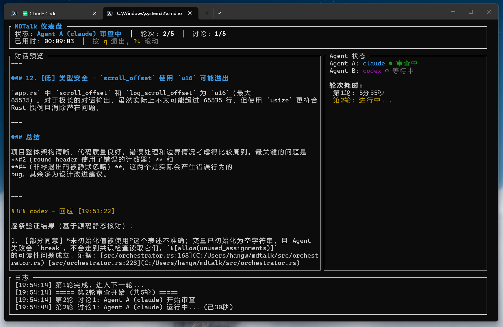
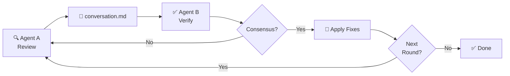

<div align="center">

<br>

<h1>🗣️ MDTalk</h1>

<h3>One AI says <em>"looks great!"</em> — Two AIs find <strong>18 real bugs</strong> and fix them.</h3>

<p><sub>The adversarial code review system that catches what single-agent review can't.</sub></p>

<p>
  <a href="https://www.rust-lang.org/"></a>&nbsp;
  <a href="https://github.com/cloveric/mdtalk"></a>&nbsp;
  <a href="LICENSE"></a>&nbsp;
  <a href="https://github.com/cloveric/mdtalk/stargazers"></a>
</p>

<p>
  <a href="#-quick-start">Quick Start</a> &nbsp;·&nbsp;
  <a href="#-how-it-works">How It Works</a> &nbsp;·&nbsp;
  <a href="#-configuration">Configuration</a> &nbsp;·&nbsp;
  <a href="#-architecture">Architecture</a> &nbsp;·&nbsp;
  <a href="#中文说明">中文</a>
</p>

<br>


<br>
<br>

</div>

## 💡 The Problem

You just finished a feature. You ask your AI to review it. It says *"looks great!"*

**Meanwhile, the pipe deadlock, the semantic parameter bug, and the sandbox permission hole are all still there.**

We ran MDTalk on its own codebase. Agent A (Claude) found 13 issues. Agent B (Codex) verified all 13, **then found 5 more**. They debated, agreed, and Agent B applied fixes to **9 files** — all in one command.

> **One AI can write your code. It takes two to review it.**

<br>

## ✨ Highlights



- 🤖 **Multi-Agent Debate** — Two AIs cross-examine each other
- 🔧 **Auto-Fix** — Agent B applies top 3 fixes after consensus
- 🔌 **Any CLI Agent** — Claude, Codex, Gemini, or your own
- 📊 **Live TUI** — Real-time dashboard with status & logs
- 🧠 **Smart Consensus** — Negation-aware keyword matching
- 🔄 **Multi-Round** — Rounds (fix code) × Exchanges (debate)

<br clear="right">

## 🔄 How It Works



> **Round** = one full debate-then-fix cycle &nbsp;|&nbsp; **Exchange** = one A↔B back-and-forth within a round

| Step | What happens |
|:---:|---|
| **1** | **Agent A** reads your source code, produces a prioritized review |
| **2** | **Agent B** independently verifies each finding against actual code |
| **3** | They debate until **consensus** or the exchange limit is hit |
| **4** | **Agent B applies** the top 3 agreed fixes to your files |
| **5** | Repeat for the next round (re-review the updated code) |

<details>
<summary><strong>📐 Rounds vs Exchanges — explained</strong></summary>
<br>

MDTalk uses a **two-layer loop**:

| Concept | Meaning | Default | Flag |
|---------|---------|:-------:|------|
| **Round** | A complete *debate + code fix* cycle. After consensus, fixes are applied, then a fresh review begins on the updated code. | 1 | `--max-rounds` |
| **Exchange** | One back-and-forth inside a round: A speaks → B responds → consensus check. | 5 | `--max-exchanges` |

**Example:** `--max-rounds 2 --max-exchanges 3`
- Up to **2 rounds** (each ending with code fixes)
- Up to **3 exchanges** per round to reach consensus
- Total: up to 6 debates, 2 rounds of code fixes

</details>

<br>

## 🚀 Quick Start

**Prerequisites:** [Rust](https://rustup.rs/) 1.75+ and at least one AI CLI — [Claude Code](https://claude.ai/download), [Codex](https://github.com/openai/codex), or any prompt-accepting CLI.

```bash
git clone https://github.com/cloveric/mdtalk && cd mdtalk
cargo install --path .
```

```bash
# Claude (A) + Codex (B) review your project
mdtalk --project /path/to/your/project

# Both agents using Claude
mdtalk --project . --agent-a claude --agent-b claude

# 2 rounds × 3 exchanges
mdtalk --project . --max-rounds 2 --max-exchanges 3

# Discuss only, don't touch code
mdtalk --project . --no-apply

# Preview the TUI layout
mdtalk --demo
```

<br>

## ⚙️ Configuration

Create `mdtalk.toml` in your project root:

```toml
[project]
path = "."

[agent_a]
name = "claude"
command = "claude"
timeout_secs = 900            # 15 min per invocation

[agent_b]
name = "codex"
command = "codex"
timeout_secs = 900

[review]
max_rounds = 1                # Debate + fix cycles
max_exchanges = 5             # A↔B exchanges per round
output_file = "conversation.md"
consensus_keywords = [
  "agree", "consensus", "LGTM", "looks good",
  "no further", "达成一致", "同意"
]
```

<details>
<summary><strong>📋 Full CLI Reference</strong></summary>

```
mdtalk [OPTIONS]

Options:
  -p, --project <PATH>        Project directory to review
  -c, --config <FILE>         Path to mdtalk.toml
      --agent-a <CMD>         Agent A command (default: claude)
      --agent-b <CMD>         Agent B command (default: codex)
  -m, --max-rounds <N>        Review rounds (default: 1)
  -e, --max-exchanges <N>     Exchanges per round (default: 5)
      --no-dashboard          Log to stdout instead of TUI
      --no-apply              Skip code modification after consensus
      --demo                  Preview dashboard with mock data
  -h, --help                  Print help
```

</details>

<br>

## 🏗️ Architecture

```
src/
├── main.rs           Entry point, CLI parsing
├── config.rs         TOML config + CLI arg merging
├── agent.rs          Async subprocess runner, deadlock prevention
├── conversation.rs   Markdown conversation file I/O
├── consensus.rs      Keyword + negation + word-boundary detection
├── orchestrator.rs   Two-layer loop, ExchangeKind state machine
└── dashboard/
    ├── mod.rs        TUI entry (spawn_blocking thread)
    ├── app.rs        App state, start confirmation screen
    ├── ui.rs         ratatui layout rendering
    └── events.rs     Keyboard handling (Windows-compatible)
```

<details>
<summary><strong>🧩 Key Design Decisions</strong></summary>

| Decision | Why |
|----------|-----|
| `spawn_blocking` for TUI | crossterm blocks the OS thread — async pool would starve the orchestrator |
| Concurrent stdout/stderr | Prevents pipe buffer deadlock on large agent output |
| `watch` + `oneshot` channels | Clean state push (orchestrator→dashboard) and start signal (dashboard→orchestrator) |
| `LineWriter` for logs | Every line survives process abort |
| `ExchangeKind` enum | Classifies exchanges as `InitialReview`, `RoundReReview`, or `FollowUp` |
| `taskkill /T /F /PID` | Kills entire Windows process tree, not just the cmd.exe wrapper |

</details>

<br>

## 📊 Real-World Results

MDTalk reviewing **its own codebase** (Claude + Codex):

| | Agent A (Claude) | Agent B (Codex) |
|:---|:---|:---|
| ⏱️ **Time** | ~80s | ~170s |
| 🔍 **Findings** | 13 issues | Verified all 13, added 5 new |
| 🤝 **Consensus** | Round 1 | Applied fixes to 9 files |

**Bugs that single-agent review missed:**

> 🐛 Pipe deadlock in subprocess management
> 🐛 Semantic bug: wrong parameter passed to conversation headers
> 🐛 Word boundary false positives in consensus detection
> 🐛 Codex sandbox silently blocking file writes

<br>

## 📄 License

[MIT](LICENSE) — use it however you like.

---

<div align="center">

<br>

**One AI says "LGTM". Two AIs find 18 bugs.**

**The best code review is a disagreement that ends in agreement.**

If this project saved you from a production bug, consider giving it a ⭐

<br>

<a href="https://github.com/cloveric/mdtalk/stargazers">⭐ Star this project</a> &nbsp;·&nbsp;
<a href="https://github.com/cloveric/mdtalk/issues">🐛 Report Bug</a> &nbsp;·&nbsp;
<a href="https://github.com/cloveric/mdtalk/issues">💡 Request Feature</a>

<br>
<br>

</div>

---

<details>
<summary><h2>中文说明</h2></summary>

<br>

### 💡 问题

你刚写完代码，让 AI 自检。它说「挺好的」。

**然而管道死锁、参数语义错误、sandbox 权限漏洞全都还在那里。**

我们用 MDTalk 审查了它自己的代码库。Agent A (Claude) 发现 13 个问题，Agent B (Codex) 全部验证通过，**又额外发现了 5 个**。它们辩论、达成共识，Agent B 直接修改了 **9 个文件** — 一条命令搞定。

> **一个 AI 能写代码。审查代码，需要两个。**

---

### ✨ 亮点

- 🤖 **多 Agent 辩论** — 两个独立 AI 交叉检验，对照源代码验证
- 🔧 **自动修复** — 达成共识后，Agent B 应用前 3 个高优先级修复
- 🔌 **任意 CLI Agent** — Claude Code、Codex、Gemini CLI 或任何 CLI 工具
- 📊 **实时 TUI** — 基于 ratatui 的仪表盘，含对话预览、状态、日志
- 🧠 **智能共识** — 关键词检测 + 否定前缀 + 词边界检查
- 🔄 **多轮审查** — 轮次（含代码修改）× 讨论（直到共识）

---

### 🔄 核心概念：轮次与讨论

| 概念 | 含义 | 默认值 | CLI 参数 |
|------|------|:------:|----------|
| **轮次 (Round)** | 一次完整的「辩论 + 代码修改」循环。达成共识后应用修复，然后重新审查更新后的代码。 | 1 | `--max-rounds` |
| **讨论 (Exchange)** | 轮次内的一次来回：A 发言 → B 回应 → 共识检测。 | 5 | `--max-exchanges` |

**举例：** `--max-rounds 2 --max-exchanges 3` = 最多 2 轮审查 × 每轮 3 次辩论 = 最多 6 次辩论 + 2 次代码修复。

---

### 🚀 快速开始

**前置条件：** [Rust](https://rustup.rs/) 1.75+，至少一个 AI CLI（[Claude Code](https://claude.ai/download)、[Codex](https://github.com/openai/codex) 等）。

```bash
git clone https://github.com/cloveric/mdtalk && cd mdtalk
cargo install --path .
```

```bash
mdtalk --project /path/to/your/project          # Claude(A) + Codex(B) 审查
mdtalk --project . --agent-a claude --agent-b claude  # 双 Claude
mdtalk --project . --max-rounds 2 --max-exchanges 3  # 2轮 × 3次讨论
mdtalk --project . --no-apply                    # 仅讨论不改代码
mdtalk --demo                                    # 预览 TUI 布局
```

---

### 📊 实际效果

MDTalk 审查自身代码库（Claude + Codex）：

| | Agent A（Claude） | Agent B（Codex） |
|:---|:---|:---|
| ⏱️ **耗时** | ~80 秒 | ~170 秒 |
| 🔍 **发现** | 13 个问题 | 验证全部 13 个，新增 5 个 |
| 🤝 **共识** | 第 1 轮达成 | 修改了 9 个文件 |

**单 agent 自检无法发现的问题：**

> 🐛 子进程管道死锁 · 🐛 对话标题传参语义错误 · 🐛 共识检测词边界误匹配 · 🐛 Codex sandbox 静默阻止写入

</details>
