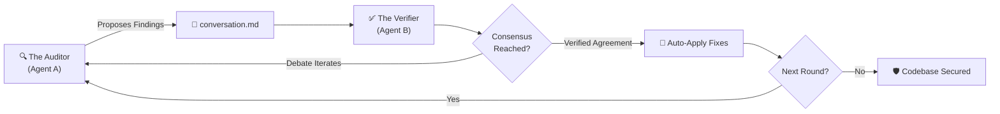

<div align="center">


<br>

<h1>MDTalk</h1>
<h3>Autonomous Adversarial Code Review System</h3>

**Your AI says *"LGTM"*. MDTalk says *"Prove it."***

[](https://www.rust-lang.org/)
[](https://github.com/cloveric/mdtalk)
[](LICENSE)
[](https://github.com/cloveric/mdtalk/stargazers)

[**English**](#-english-documentation) | [**中文文档**](#-中文文档-chinese-documentation)

<br>

> **MDTalk** is an uncompromising, multi-agent code auditing framework. It replaces passive AI compliance with rigorous adversarial debate, ensuring mission-critical code quality through cross-examination.

</div>

---

<br>

## 🇬🇧 English Documentation

### 🧨 The Illusion of "LGTM"
You push a complex feature. You ask a single AI model to review it. In seconds, it replies: *"Looks great to me!"*
Production breaks. Why? Single-agent AI is inherently compliant and prone to hallucination. It misses edge cases, race conditions, and semantic flaws because it lacks a verification mechanism.

### 🛡️ The Solution: Adversarial Intelligence
**MDTalk** deploys a dual-agent architecture to completely eliminate AI complacency.
- **The Auditor (Agent A):** Systematically analyzes your codebase, proposing vulnerabilities, anti-patterns, and logical flaws.
- **The Verifier (Agent B):** Skeptically validates every claim made by the Auditor against the actual source code.

They engage in an autonomous, rigorous debate. **No human intervention is required.** They cross-examine, push back, and iterate until a mathematically hard consensus is reached. Only then are verified fixes applied directly to your codebase.

> *In our internal benchmarks, a single AI missed 5 critical bugs. MDTalk found all of them, debated the optimal fix, and applied the changes across 9 files autonomously.*

---

### ✨ Enterprise-Grade Features
- **Adversarial Debate Engine:** Two independent AI models (e.g., Claude & Codex) auditing each other to guarantee zero hallucinations.
- **Autonomous Resolution:** Once consensus is achieved, verified fixes are surgically applied to your source files in real-time.
- **Universal LLM Integration:** Seamlessly connect with Claude Code, Codex, Gemini, or any standard CLI-based AI agent.
- **Advanced Contextual Consensus:** Powered by a sophisticated parsing engine that understands negations, word boundaries, and nuanced agreement.
- **Premium Terminal UI:** Monitor the entire auditing process through a beautifully crafted, highly responsive Ratatui dashboard.

<br>

### 🖥️ Work Interface

Experience the auditing process in real-time with our state-of-the-art terminal dashboard.

<div align="center">
  
  <br><br>
  
</div>

<br>

### 🚀 Quick Start
**Prerequisites:** [Rust](https://rustup.rs/) 1.75+ and at least one AI CLI (e.g., [Claude Code](https://claude.ai/download)).

```bash
# 1. Install the auditing framework
cargo install --git https://github.com/cloveric/mdtalk --tag <release-tag> mdtalk

# 2. Initiate an adversarial review on your project
mdtalk --project /path/to/your/project

# 3. Force two Claude instances to cross-examine each other
mdtalk --project . --agent-a claude --agent-b claude

# 4. Preview the UI dashboard
mdtalk --demo
```

### ⚙️ System Architecture



---

<br>

## 🇨🇳 中文文档 (Chinese Documentation)

<div align="center">
  <h1>MDTalk (左右互博)</h1>
  <h3>下一代对抗性 AI 代码审计系统</h3>
  <p><b>拒绝虚假的“代码不错 (LGTM)”。用交叉验证重塑代码审查。</b></p>
</div>

### 🧨 “看似完美”的错觉
当你向单一的 AI 助手提交数千行的复杂功能进行审查时，它往往会在几秒钟内回复：“逻辑严密，代码优秀 (LGTM)”。
然而，潜藏在代码深处的并发死锁、参数语义错误和提权漏洞依然存在。单一 AI 模型天生具有“迎合性”和“幻觉”倾向，缺乏严谨的自我验证闭环。

### 🛡️ 破局：对抗性多智能体架构
**左右互博 (MDTalk)** 彻底颠覆了传统的 AI 审查模式。它引入了双重独立的 AI 智能体，让它们在你的代码库中进行高强度的交叉盘问：
- **审计者 (Agent A)：** 负责深度扫描、主动出击，无情地挖掘代码库中的每一个潜在缺陷。
- **验证者 (Agent B)：** 充当怀疑论者，结合真实的源代码，逐一验证审计者提出的每一个问题。

它们会在没有人类干预的情况下展开激烈的技术辩论。互相反驳、不断推演，直至达成**不可辩驳的共识**。最终，验证者会自动将无争议的极致修复方案精准应用到你的代码中。

> *在我们的内部测试中，单一 AI 遗漏了 5 个核心漏洞；而 MDTalk 成功捕获了全部问题，不仅推演出了最佳修复方案，还全自动完成了 9 个文件的修改。*

---

### ✨ 核心优势
- **对抗性验证引擎**：双模型（如 Claude 对抗 Codex）互为攻守，从根本上消除 AI 幻觉，确保审查结果的绝对可靠。
- **零妥协自动修复**：一旦达成技术共识，系统将以“手术刀级别”的精度自动修改源码，无需人工复制粘贴。
- **无缝接入任意大模型**：完美适配 Claude Code, Codex, Gemini CLI 或任何基于命令行的 AI 工具。
- **高级语义共识识别**：内置智能解析器，精准识别上下文、词边界及否定语境，绝不被模棱两可的辞藻糊弄。
- **极客级终端大屏 (TUI)**：基于 Ratatui 构建的实时终端可视化面板，以极其优雅的方式呈现 AI 间的思维碰撞。

<br>

### 🖥️ 运行界面
通过我们精心设计的终端面板，全景掌控对抗审查的每一处细节。

<div align="center">
  
  <br><br>
  
</div>

<br>

### 🚀 快速接入
**环境要求：** [Rust](https://rustup.rs/) 1.75+ 以及至少一个可用的 AI 命令行工具（如 [Claude Code](https://claude.ai/download)）。

```bash
# 1. 部署这款企业级审计框架 (开发者推荐本地编译运行)
git clone https://github.com/cloveric/mdtalk && cd mdtalk
cargo run -- --project .

# 2. 对当前项目发起对抗审查
mdtalk --project /path/to/your/project

# 3. 指定双端模型（如：双 Claude 内部博弈）
mdtalk --project . --agent-a claude --agent-b claude

# 4. 预览 TUI 可视化布局
mdtalk --demo
```

<br>

<div align="center">

---

🔥 **让每一次提交都无懈可击。体验未来级的代码审查。** 🔥

如果这款工具帮助你拦截了生产环境的致命故障，**请给予我们一颗 🌟 Star**。

[](https://github.com/cloveric/mdtalk/stargazers)

[🐛 提交 Issue](https://github.com/cloveric/mdtalk/issues) &nbsp;·&nbsp; [💡 探讨未来特性](https://github.com/cloveric/mdtalk/issues)

</div>