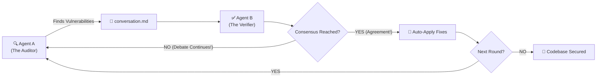

<div align="center">

# ⚔️ MDTalk (左右互博) ⚔️
## 🚀 The Ultimate AI Code Review Gladiator Arena 🚀
### Your AI says *"LGTM"*. MDTalk says *"PROVE IT"*.

<br>


<br>

[](https://www.rust-lang.org/)
[](https://github.com/cloveric/mdtalk)
[](LICENSE)
[](https://github.com/cloveric/mdtalk/stargazers)

[**English**](#-english-documentation) | [**中文文档**](#-中文文档-chinese-documentation)

<br>

> ⚠️ **WARNING**: MDTalk is NOT your average polite AI reviewer. It is an **aggressive**, **unrelenting**, **multi-agent battleground** where AI models cross-examine each other's code to ruthlessly eliminate bugs.

</div>

---

<br>

## 🇬🇧 English Documentation

### 🤯 The Problem: The "LGTM" Illusion
You just finished a 2,000-line feature. You ask your AI coding assistant to review it.  
It replies in 3 seconds: *"Looks great to me! (LGTM)"* 🎉  
**WRONG.**  
Production goes down. Why? Because a single AI model is complacent, lazy, and hallucinates. The pipe deadlock, the semantic parameter bug, and the sandbox permission hole are all still there.

### 💡 The Solution: Adversarial AI Cross-Examination
**MDTalk** pits **TWO** independent AI agents (e.g., Claude vs. Codex) against each other in a fierce debate. 
- **Agent A** acts as the aggressive auditor, ripping your codebase apart to find flaws.
- **Agent B** acts as the skeptical verifier, double-checking A's claims against the actual code.
They will argue, debate, and fight until they reach a **hard consensus**. Only then will Agent B automatically apply the undisputed fixes directly to your codebase!

**We ran MDTalk on its own codebase. Agent A (Claude) found 13 issues. Agent B (Codex) verified all 13, then found 5 MORE. They debated, agreed, and Agent B applied fixes to 9 files — all in ONE command.**

---

### 🔥 Mind-Blowing Features
- ⚔️ **Gladiator-Style Multi-Agent Debate:** Two AIs cross-examine each other with zero human intervention.
- ⚡ **Zero-Touch Auto-Fix:** Once consensus is reached, the agreed-upon fixes are applied straight to your files!
- 🔌 **Universal AI Compatibility:** Plugs into Claude Code, Codex, Gemini CLI, or *any* CLI-based AI agent.
- 🖥️ **Stunning Live TUI Dashboard:** Watch the AI battle unfold in real-time with an incredibly sleek Ratatui-based terminal UI!
- 🧠 **Negation-Aware Smart Consensus:** Our engine doesn't just look for "yes". It understands context, boundaries, and negations before declaring a truce.

<br>

<div align="center">
  
</div>

<br>

### 🛠️ Work Interface

<p align="center">
  
  &nbsp;
  
</p>

### 🚀 Quick Start
**Prerequisites:** [Rust](https://rustup.rs/) 1.75+ and at least one AI CLI (like [Claude Code](https://claude.ai/download)).

```bash
# 1. Install the ultimate review weapon
cargo install --git https://github.com/cloveric/mdtalk --tag <release-tag> mdtalk

# 2. Unleash the beasts on your project
mdtalk --project /path/to/your/project

# 3. Want an all-Claude civil war?
mdtalk --project . --agent-a claude --agent-b claude

# 4. Preview the stunning TUI layout
mdtalk --demo
```

### ⚙️ How It Actually Works (The Architecture of Destruction)



---

<br>

## 🇨🇳 中文文档 (Chinese Documentation)

<div align="center">
  <h2>⚔️ 左右互博 (MDTalk) ⚔️</h2>
  <h3>你的 AI 助理只会说“写得不错”？左右互博让两个 AI 开启无情代码审查互殴！</h3>
</div>

### 🤯 痛点：被“敷衍”的代码审查
你刚刚爆肝写完了一个 2000 行的复杂功能。你满怀期待地问你的 AI 助手：“帮我 review 一下？”  
3秒钟后，它回复你：“代码结构清晰，逻辑严密，LGTM（看起来不错）！” 🎉  
**大错特错！**  
一上线就崩溃了！为什么？因为单一的 AI 模型会偷懒、会幻觉、会为了迎合你而敷衍了事。那些致命的管道死锁、参数语义错误、沙盒权限漏洞，它根本没看出来！

### 💡 革命性方案：AI 交叉火力对决
**左右互博 (MDTalk)** 引入了**两个独立的 AI 智能体**（例如 Claude VS Codex），让它们在你的代码库里展开殊死搏斗！
- **Agent A (挑刺狂魔)**：拿着放大镜逐行扫描你的代码，无情地指出所有潜在漏洞和坏味道。
- **Agent B (怀疑论者)**：不盲目相信 A 的话，拿着 A 的审查报告去实际代码里逐一验证。
它们会互相反驳、激烈辩论，直到达成**绝对的共识**。一旦它们停止争吵，Agent B 就会自动将双方都同意的修复方案**直接应用到你的代码中**！

**我们在 MDTalk 自己的源码上运行了它。Agent A (Claude) 找出了 13 个隐藏 Bug。Agent B (Codex) 不仅验证了这 13 个，还顺手又找出了 5 个新 Bug！经过一轮激烈的辩论，它们达成了共识，然后一条命令自动修复了 9 个文件。**

> **这绝不是走过场的“复核”，这是真刀真枪的“交叉盘问”！**

---

### 🔥 炸裂核心特性
- ⚔️ **多智能体互殴 (Multi-Agent Debate)**：两个 AI 无情互撕，人类只需在一旁吃瓜看戏！
- ⚡ **全自动手术刀式修复 (Auto-Fix)**：一旦 AI 达成共识，立刻自动修改代码，无需你手动复制粘贴！
- 🔌 **万能插件化接入 (Universal CLI)**：完美兼容 Claude Code, Codex, Gemini CLI，或者任何你正在使用的命令行 AI 工具！
- 🖥️ **赛博朋克风终端 UI (Live TUI)**：基于 Ratatui 打造的超华丽实时终端监控大屏，沉浸式观赏 AI 互博实况！
- 🧠 **超强语义共识引擎 (Smart Consensus)**：精准识别“同意”、“达成共识”关键词，甚至能识别否定前缀和词边界，绝不被 AI 糊弄！

### 🚀 极速体验
**环境要求：** [Rust](https://rustup.rs/) 1.75+ 以及至少一个 AI CLI 工具（比如 [Claude Code](https://claude.ai/download)）。

```bash
# 1. 装备这把终极代码审查神器 (开发者推荐本地运行)
git clone https://github.com/cloveric/mdtalk && cd mdtalk
cargo run -- --project .

# 2. 让两个 AI 开始审查你的项目
mdtalk --project /path/to/your/project

# 3. 开启双 Claude 的终极内战！
mdtalk --project . --agent-a claude --agent-b claude

# 4. 预览极其华丽的终端 UI
mdtalk --demo
```

### ⚙️ 核心参数与工作流流转

| 概念 | 战斗法则 | 默认值 | 调整指令 |
|------|----------|:------:|----------|
| **轮次 (Round)** | 一次完整的“死斗+修复”循环。打完一架，改完代码，拿着新代码再打一架！ | 1 | `--max-rounds` |
| **讨论 (Exchange)** | 每一轮里面的互喷回合数：A 喷一句 → B 回喷一句 → 看看有没有达成共识。 | 5 | `--max-exchanges` |

**举例说明：** `--max-rounds 2 --max-exchanges 3`  
意思是：最多打 2 场大战（包含2次代码自动修复），每场大战里最多互喷 3 个回合！

<br>

<div align="center">

---

🔥 **普通的 AI 告诉你 "代码不错"。左右互博告诉你 "拿命来证明！"** 🔥  
**最好的代码审查，就是一场以共识告终的激烈争吵。**

如果这个项目曾经拯救过你的生产环境（或者即将拯救），**请用你的 ⭐ 狠狠地砸向我们！**

[](https://github.com/cloveric/mdtalk/stargazers)

[🐛 报告 Bug](https://github.com/cloveric/mdtalk/issues) &nbsp;·&nbsp; [💡 提出神仙需求](https://github.com/cloveric/mdtalk/issues)

</div>
