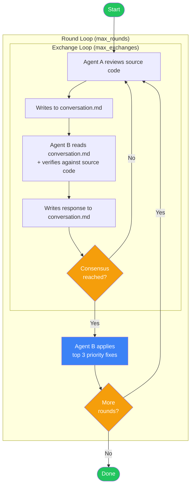

<div align="center">

<h1>MDTalk</h1>

<p><strong>Let two AI agents debate your code — then fix it.</strong></p>

<p>
  <a href="https://www.rust-lang.org/"></a>
  <a href="https://github.com/cloveric/mdtalk"></a>
  <a href="LICENSE"></a>
  <a href="https://github.com/cloveric/mdtalk"></a>
</p>

<p>
  <a href="#-quick-start">Quick Start</a> ·
  <a href="#-how-it-works">How It Works</a> ·
  <a href="#-key-concepts-rounds--exchanges">Key Concepts</a> ·
  <a href="#-configuration">Configuration</a> ·
  <a href="#-architecture">Architecture</a>
</p>

</div>

---

## The Problem

You've just finished a feature. You ask your AI to review the code. It says it looks great — maybe tweaks a comment or two. But the real bug is still there.

**The same AI that wrote it can't properly review it.** One perspective is never enough.

MDTalk solves this by making two independent AI agents cross-examine each other's findings against your actual source code — then apply the fixes they both agree on.

---

## Live Dashboard

<div align="center">


<p><em>Claude (Agent A) and Codex (Agent B) reviewing code in real-time</em></p>

</div>

---

## Highlights

| Feature | Description |
|---------|-------------|
| **Multi-Agent Debate** | Two independent AIs cross-examine each other's findings against actual source code |
| **Auto-Fix** | After consensus, Agent B applies the top 3 high-priority fixes directly to your codebase |
| **Any CLI Agent** | Claude Code, OpenAI Codex, Gemini CLI, or any tool that accepts a prompt |
| **Live TUI** | Real-time [ratatui](https://github.com/ratatui/ratatui) dashboard with conversation preview, agent status, timing, and scrollable logs |
| **Smart Consensus** | Keyword detection with negation handling and word boundary checks |
| **Multi-Round** | Outer review rounds (with code fixes) × inner exchange debates (until consensus) |

---

## How It Works



1. **Agent A** reads your source code, produces a prioritized review
2. **Agent B** independently verifies each finding against actual code
3. They debate until they reach **consensus** or hit the exchange limit
4. **Agent B applies the agreed fixes** directly to your files
5. Repeat for as many rounds as configured

---

## Key Concepts: Rounds & Exchanges

MDTalk uses a **two-layer loop** to structure the review process:

| Concept | What it is | Default | CLI flag |
|---------|-----------|---------|----------|
| **Round** | One complete cycle of *debate + code fix*. After agents reach consensus, Agent B applies the top 3 fixes, then the next round starts with a fresh review of the updated code. | 1 | `--max-rounds` |
| **Exchange** | One back-and-forth within a round: Agent A speaks, Agent B responds, consensus is checked. Multiple exchanges may happen before agents agree. | 5 | `--max-exchanges` |

**Example:** `--max-rounds 2 --max-exchanges 3` means:
- Up to **2 rounds** of review (each ending with code fixes)
- Within each round, up to **3 exchanges** (A↔B debates) to reach consensus
- Total: the agents could have up to 6 debates and apply fixes twice

---

## Quick Start

### Prerequisites

- [Rust](https://rustup.rs/) 1.75+
- At least one AI CLI agent:
  - [Claude Code](https://claude.ai/download) — `claude`
  - [Codex CLI](https://github.com/openai/codex) — `codex`
  - Or any CLI that accepts a prompt argument

### Install

```bash
git clone https://github.com/cloveric/mdtalk
cd mdtalk
cargo install --path .
```

### Run

```bash
# Claude (A) + Codex (B) review your project
mdtalk --project /path/to/your/project

# Both agents using Claude
mdtalk --project . --agent-a claude --agent-b claude

# 2 rounds, 3 exchanges each
mdtalk --project . --max-rounds 2 --max-exchanges 3

# Discussion only, no code changes
mdtalk --project . --no-apply

# Use config file
mdtalk --config mdtalk.toml

# Preview dashboard layout
mdtalk --demo
```

---

## Configuration

Create `mdtalk.toml` in your project root:

```toml
[project]
path = "."

[agent_a]
name = "claude"
command = "claude"
timeout_secs = 900            # 15 min per invocation

[agent_b]
name = "codex"
command = "codex"
timeout_secs = 900

[review]
max_rounds = 1                # Review cycles (debate + fix)
max_exchanges = 5             # Max A↔B exchanges per round
output_file = "conversation.md"
consensus_keywords = [
  "agree", "consensus", "LGTM", "looks good",
  "no further", "达成一致", "同意"
]
```

---

## CLI Reference

```
mdtalk [OPTIONS]

Options:
  -p, --project <PATH>        Project directory to review
  -c, --config <FILE>         Path to mdtalk.toml
      --agent-a <CMD>         Agent A command (default: claude)
      --agent-b <CMD>         Agent B command (default: codex)
  -m, --max-rounds <N>        Review rounds (default: 1)
  -e, --max-exchanges <N>     Exchanges per round (default: 5)
      --no-dashboard          Log to stdout instead of TUI
      --no-apply              Skip code modification after consensus
      --demo                  Preview dashboard with mock data
  -h, --help                  Print help
```

---

## Architecture

```
mdtalk/src/
├── main.rs           # Entry point, CLI parsing
├── config.rs         # TOML config + CLI arg merging
├── agent.rs          # Async subprocess runner, deadlock prevention
├── conversation.rs   # Markdown conversation file I/O
├── consensus.rs      # Keyword + negation + word-boundary detection
├── orchestrator.rs   # Two-layer loop, ExchangeKind state machine
└── dashboard/
    ├── mod.rs        # TUI entry (spawn_blocking thread)
    ├── app.rs        # App state, start confirmation screen
    ├── ui.rs         # ratatui layout rendering
    └── events.rs     # Keyboard handling (Windows-compatible)
```

**Key Design Decisions:**

| Decision | Rationale |
|----------|-----------|
| `spawn_blocking` for TUI | crossterm blocks the OS thread — running on tokio's async pool would starve the orchestrator |
| Concurrent stdout/stderr reads | Prevents pipe buffer deadlock when agent output is large |
| `watch` + `oneshot` channels | Clean orchestrator→dashboard state push and dashboard→orchestrator start signal |
| `LineWriter` for log file | Ensures every log line survives process abort |
| `ExchangeKind` enum | Cleanly classifies exchanges as `InitialReview`, `RoundReReview`, or `FollowUp` |
| `taskkill /T /F /PID` on Windows | Kills the entire process tree, not just the wrapper cmd.exe |

---

## Real-World Results

MDTalk reviewing its own codebase (Claude + Codex):

| | Agent A (Claude) | Agent B (Codex) |
|---|---|---|
| **Time** | ~80s | ~170s |
| **Findings** | 13 issues | Verified all 13, added 5 new |
| **Consensus** | Round 1 | Applied fixes to 9 files |

**Issues discovered that single-agent review missed:**
- Pipe deadlock in subprocess management
- Semantic bug passing wrong parameter to conversation headers
- Word boundary false positives in consensus detection
- Codex sandbox silently blocking file writes

---

## License

[MIT](LICENSE)

---

<div align="center">

**MDTalk** — the best code review is a disagreement that ends in agreement.

<br>

<a href="https://github.com/cloveric/mdtalk">Star on GitHub</a> · <a href="https://github.com/cloveric/mdtalk/issues">Report Bug</a> · <a href="https://github.com/cloveric/mdtalk/issues">Request Feature</a>

</div>

---

<details>
<summary><h2>中文说明</h2></summary>

### 问题

你刚写完代码，让 AI 自检。它说挺好的。但真正的 bug 还在那里。**写代码的 AI 检查不出自己的问题**。一个视角永远不够。

MDTalk 让两个独立的 AI agent 交叉检验对方的发现，对照你的实际源代码进行辩论，然后应用双方都认可的修复。

---

### 实时仪表盘

<div align="center">

<p><em>Claude（Agent A）和 Codex（Agent B）正在实时审查代码</em></p>
</div>

---

### 亮点

| 特性 | 说明 |
|------|------|
| **多 Agent 辩论** | 两个独立 AI 交叉检验对方发现，对照实际源代码验证 |
| **自动修复** | 达成共识后，Agent B 直接修改代码，应用前 3 个高优先级修复 |
| **任意 CLI Agent** | 支持 Claude Code、OpenAI Codex、Gemini CLI 或任何接受 prompt 的 CLI 工具 |
| **实时 TUI** | 基于 [ratatui](https://github.com/ratatui/ratatui) 的实时仪表盘，含对话预览、Agent 状态、计时、可滚动日志 |
| **智能共识** | 关键词检测 + 否定前缀处理 + 词边界检查，避免误判 |
| **多轮审查** | 外层轮次（含代码修改）× 内层讨论（直到达成共识） |

---

### 核心概念：轮次与讨论

MDTalk 使用**两层循环**来组织审查流程：

| 概念 | 含义 | 默认值 | CLI 参数 |
|------|------|--------|----------|
| **轮次（Round）** | 一次完整的「辩论 + 代码修改」循环。Agent 达成共识后，Agent B 应用前 3 个修复，然后开始下一轮对更新后的代码重新审查。 | 1 | `--max-rounds` |
| **讨论（Exchange）** | 轮次内的一次来回：Agent A 发言 → Agent B 回应 → 检测共识。可能需要多次讨论才能达成一致。 | 5 | `--max-exchanges` |

**举例：** `--max-rounds 2 --max-exchanges 3` 表示：
- 最多 **2 轮**审查（每轮结束后修改代码）
- 每轮内最多 **3 次讨论**（A↔B 来回辩论）达成共识
- 总计：最多 6 次辩论，修改代码 2 次

---

### 快速开始

#### 前置条件

- [Rust](https://rustup.rs/) 1.75+
- 至少一个 AI CLI agent：
  - [Claude Code](https://claude.ai/download) — `claude`
  - [Codex CLI](https://github.com/openai/codex) — `codex`
  - 或任何接受 prompt 参数的 CLI 工具

#### 安装

```bash
git clone https://github.com/cloveric/mdtalk
cd mdtalk
cargo install --path .
```

#### 运行

```bash
# Claude（A）+ Codex（B）审查你的项目
mdtalk --project /path/to/your/project

# 两个 agent 都用 Claude
mdtalk --project . --agent-a claude --agent-b claude

# 2 轮审查，每轮 3 次讨论
mdtalk --project . --max-rounds 2 --max-exchanges 3

# 仅讨论，不修改代码
mdtalk --project . --no-apply

# 使用配置文件
mdtalk --config mdtalk.toml

# 预览仪表盘布局
mdtalk --demo
```

---

### 实际效果

MDTalk 审查自身代码库（Claude + Codex）：

| | Agent A（Claude） | Agent B（Codex） |
|---|---|---|
| **耗时** | ~80 秒 | ~170 秒 |
| **发现** | 13 个问题 | 验证全部 13 个，新增 5 个 |
| **共识** | 第 1 轮达成 | 修改了 9 个文件 |

**单 agent 自检无法发现的问题：**
- 子进程管道死锁
- 对话标题传参语义错误
- 共识检测的词边界误匹配
- Codex sandbox 静默阻止文件写入

</details>
